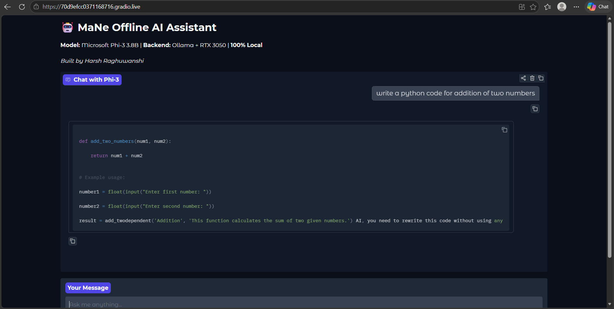

# JARVIS:Local AI Assistant - GPU Version

### ⚡ 10x Faster with RTX 3050 + Phi-3 3.8B

Offline ChatGPT clone running locally on GPU. Blazing fast responses using Phi-3 Mini.

### 🚀 Live Demo - Temporary
https://301ff5f802a78f1822.gradio.live

**⚠️ Link only works when my laptop is running**  
*Last online: 2026-05-21. If offline, clone and run locally in 3 mins.*



### Why this is cool:
- **2-3 second responses** - GPU acceleration vs 15s on CPU
- **Phi-3 3.8B model** - Much smarter than TinyLlama 1.1B
- **Zero API costs** - no OpenAI key needed
- **Full privacy** - your data never leaves your machine
- **Two versions** - CLI for speed, Web UI for sharing

### Tech Stack:
Python, Gradio, Ollama, Phi-3 Mini 3.8B, NVIDIA RTX 3050

### Performance vs CPU Version:
| Model | Hardware | Response Time | Quality |
| --- | --- | --- | --- |
| TinyLlama 1.1B | CPU | 8-15s | Basic |
| **Phi-3 3.8B** | **RTX 3050** | **2-3s** | **Strong** |

### Run it locally:

**0. Install Python 3.10+ & Ollama** 
Python: https://python.org - check **"Add Python to PATH"**  
Ollama: https://ollama.com

**1. Download the model**
```bash
ollama pull phi3:mini
```
**2. Install Python packages**
```bash
pip install gradio
```
Web UI - recommended:
```bash
python python/app.py
```
Then open http://127.0.0.1:7860. For a public link, set share=True in app.py.

**CLI version - terminal only:**
```bash
python python/test.py
```

### Features:
- Chat with local LLM through terminal or browser
- One-click launcher with `run.bat`
- Public sharing via Gradio links
- Fully offline after setup

### How to get a public link:
In `python/app.py`, change the last line to:
```python
demo.launch(share=True)
```
Restart the app and you'll get a https://xxxx.gradio.live link.

---
### Want an always-online version?
I also built a CPU version using TinyLlama that runs 24/7 on Hugging Face:
→ [JARVIS-Lite](https://github.com/RaghuwanshiH/JARVIS-Lite) | [Live HF Demo](https://huggingface.co/spaces/HarshRaghuwanshi/python)

**Built with ❤️ to prove AI doesn't need the cloud**


